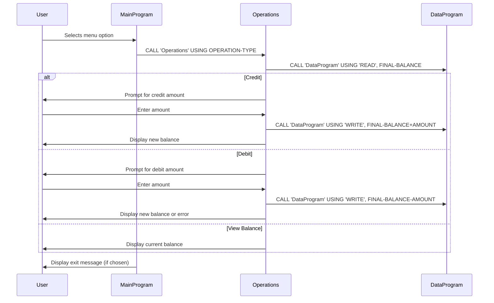

# COBOL Student Account Management System

This project is a simple COBOL-based system for managing student accounts. It allows users to view balances, credit, and debit accounts through a terminal interface.

## Purpose of Each COBOL File

### main.cob
- **Purpose:** Entry point and user interface for the account management system.
- **Key Functions:**
  - Displays a menu for account operations (View Balance, Credit, Debit, Exit).
  - Accepts user input and calls the appropriate operation in `operations.cob`.
- **Business Rules:**
  - Only allows choices 1-4; prompts again for invalid input.
  - Exits cleanly when the user selects Exit.

### operations.cob
- **Purpose:** Implements the core business logic for account operations.
- **Key Functions:**
  - Handles three main operations: `TOTAL` (view balance), `CREDIT` (add funds), and `DEBIT` (withdraw funds).
  - Calls `data.cob` to read or update the account balance.
- **Business Rules:**
  - For `CREDIT`, prompts for an amount, adds it to the balance, and saves the new balance.
  - For `DEBIT`, prompts for an amount, checks if sufficient funds exist, subtracts if possible, and saves the new balance. If insufficient funds, displays an error.
  - For `TOTAL`, simply displays the current balance.

### data.cob
- **Purpose:** Manages persistent storage of the account balance.
- **Key Functions:**
  - Provides `READ` and `WRITE` operations for the account balance.
  - Stores the balance in a variable (`STORAGE-BALANCE`).
- **Business Rules:**
  - `READ` returns the current balance.
  - `WRITE` updates the stored balance with a new value.

## Business Rules Summary
- All account operations are performed on a single balance value.
- Credit and debit operations require user input for the amount.
- Debit operations are only allowed if the balance is sufficient.
- The system starts with a default balance of 1000.00.

---

For more details, see the source code in `/src/cobol/`.

---

## Sequence Diagram: Data Flow

